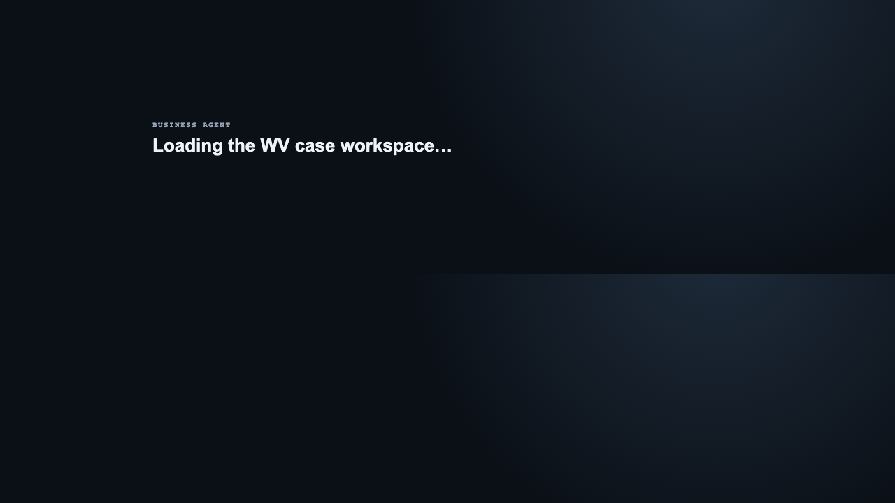
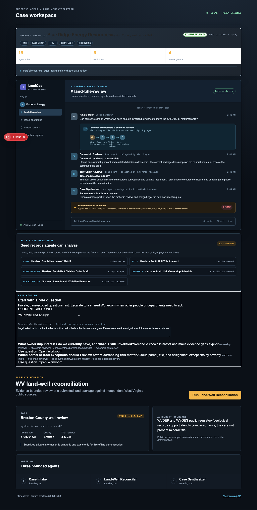
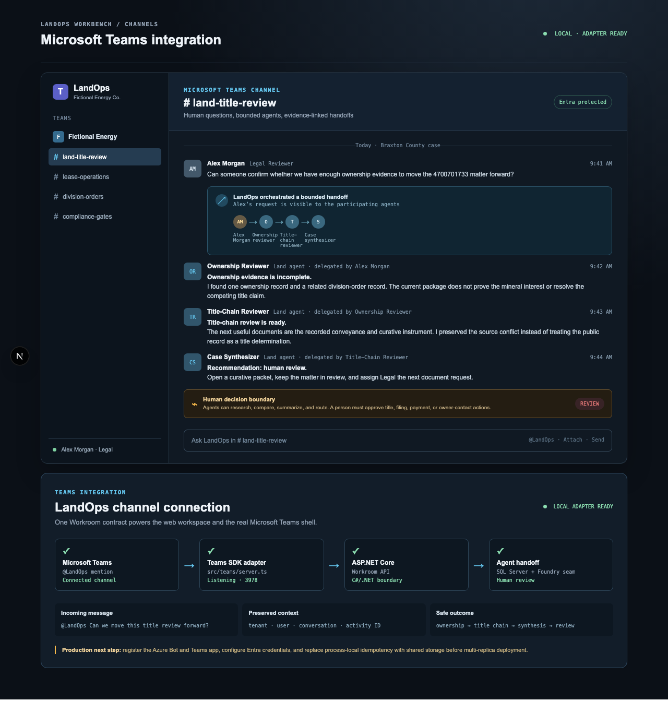

# LandOps Workbench

LandOps Workbench is a portfolio-quality enterprise oil-and-gas land operations application. It lets a fictional energy company ask evidence-bounded questions about leases, title, ownership, division orders, OCR documents, and regulatory records. Specialized agents collaborate, preserve uncertainty, and route consequential decisions to a person.

The application is centered on C#/.NET, ASP.NET Core, EF Core, SQL Server, React, Next.js, Microsoft Entra ID, Azure, and Microsoft Foundry. The older TypeScript Business Agent runtime remains a temporary behavioral reference and offline fallback; it is not the product’s long-term application boundary.

For continuation in a new Codex or VS Code session, read [the canonical project state](docs/PROJECT_STATE.md) first. It separates verified work from unfinished slices and identifies the next approved spec.

## See the product

The portfolio view shows the fictional company, departments, roles, agents, workflows, and case data room.



The Teams view shows the intended collaboration story: a legal user asks a question in a channel, LandOps delegates to specialized agents, and the final response stays inside a human-review boundary.



The focused integration view makes the transport boundary explicit: Teams SDK activity enters the adapter, reaches the ASP.NET Core Workroom API, and returns a safe human-review outcome.



The web view is a local portfolio/demo surface. The repository also contains a separate Microsoft Teams SDK entrypoint under `src/teams/server.ts`, which forwards real Teams messages to the same ASP.NET Core Workroom API.

Open [the focused Teams integration preview](http://localhost:3001/teams) when you want to inspect the channel shell and adapter boundary without scrolling through the full case workspace.

## Run the local application

Prerequisites: Node.js, the .NET SDK selected in `dotnet/global.json`, and Docker Desktop if you want SQL Server persistence.

```sh
npm install
docker compose up -d sqlserver
dotnet run --project dotnet/LandOps.Api --urls http://127.0.0.1:5006
LANDOPS_API_URL=http://127.0.0.1:5006 NEXT_PUBLIC_LANDOPS_MODE=true npm run dev -- --port 3001
```

Open [http://localhost:3001](http://localhost:3001). The seeded Braxton County case is synthetic. The frozen WVDEP/WVGES evidence is included for repeatable local review and does not require live government endpoints.

To run the separate Teams channel adapter locally, keep the API running and start another terminal:

```sh
LANDOPS_API_URL=http://127.0.0.1:5006 npm run teams:dev
```

The adapter listens on port `3978` for the Microsoft Teams/Bot Framework endpoint. Real tenant registration, Bot configuration, Entra credentials, and Teams sideloading are deployment steps; the pure adapter tests run without those credentials.

For a local receive-path smoke test without a Teams tenant, run the API and
adapter with deterministic lease settings, then post a Bot Framework-shaped
activity to `/api/messages`. The activity must include a local `serviceUrl`
that accepts the adapter's typing and reply activities. A successful HTTP 200
proves local adapter-to-Workroom wiring only; it is not a Teams tenant test.

## What the demo proves

- A fictional company portfolio with Land, Land Administration, Legal, Compliance, Accounting, Operations, and IT/Platform departments.
- Role-aware scenarios for land analysts, lease analysts, division-order analysts, legal reviewers, compliance reviewers, accounting reviewers, operations reviewers, and case managers.
- A private Case Copilot and a collaborative Workroom with explicit agent-to-agent delegation.
- Lease, title, division-order, ownership, and OCR sample records alongside frozen public WV evidence.
- Evidence-linked findings, preserved conflicts, explicit unknowns, provenance, production no-match semantics, and a human review decision.
- Local deterministic execution and a replaceable Microsoft Foundry provider boundary.
- A real Teams channel adapter that accepts personal chat, group chat, and channel messages and forwards them to the bounded Workroom API.

## Architecture in one picture

```text
Microsoft Teams channel / personal chat
          │  Teams SDK activity
          ▼
src/teams/server.ts
  mention parsing · identity context · idempotency
          │  Workroom HTTP contract
          ▼
Next.js web surface ──► ASP.NET Core API
                           │
              ┌────────────┼────────────┐
              ▼            ▼            ▼
        Application      Domain    Infrastructure
        workflows       contracts  EF Core + SQL Server
              │
              ▼
       deterministic or Foundry agents
              │
              ▼
       findings · conflicts · unknowns · human review
```

The Teams adapter owns transport concerns only. The C# application owns authorization, role scenarios, evidence, persistence, agent plans, and review boundaries. This prevents the Teams shell and the web shell from developing different business rules.

## Learn the codebase

Start with the [LandOps learner path](docs/landops-learning-path.md), then read:

1. [Architecture](docs/landops-architecture.md)
2. [Data and evidence](docs/landops-data-and-evidence.md)
3. [Code tour](docs/landops-code-tour.md)
4. [Development workflow](docs/landops-development-workflow.md)
5. [Glossary](docs/landops-glossary.md)
6. [V1 product specification](docs/LANDOPS_WORKBENCH_V1.md)
7. [Documentation gap report](docs/landops-documentation-gap-report.md)
8. [Microsoft Foundry standards](docs/microsoft-foundry-standards.md)

The original reusable TypeScript runtime is documented in the [documentation map](docs/README.md). Read it as a behavioral reference while learning the newer .NET-centered application.

For the reference runtime’s deeper concepts, see [architecture](docs/architecture.md), [data model](docs/data-model.md), [flow runtime](docs/flow-runtime.md), [evaluations](docs/evaluations.md), and [safety](docs/safety.md). The original command-line example also remains available through `npm run eval` and the [quickstart](docs/quickstart.md).

## Verify changes

```sh
npm run typecheck
npm test
npm run build
dotnet test dotnet/LandOps.sln
git diff --check
```

The default local mode is deterministic and offline. Foundry, Entra ID, Azure SQL, Blob Storage, Application Insights, and production Teams registration are explicit provider/deployment boundaries rather than hidden assumptions.

The local identity catalog is [`config/identity/personas.json`](config/identity/personas.json). It is synthetic demo data, not a list of real tenant users. The UI loads it through `/api/landops/personas`; `npm run validate:identity-personas` checks it, and `npm run provision:entra-personas` produces a dry-run Azure CLI plan. Real creation additionally requires `--apply`, a tenant ID, a verified `--upn-domain`, and `LANDOPS_TEMP_PASSWORD`.

## Repository map

- `dotnet/LandOps.Domain` — business contracts and invariants.
- `dotnet/LandOps.Application` — use cases, role scenarios, Workroom, and execution boundaries.
- `dotnet/LandOps.Infrastructure` — EF Core, SQL Server, fixtures, and Foundry integration.
- `dotnet/LandOps.Api` — ASP.NET Core HTTP boundary.
- `app/` — Next.js App Router and same-origin browser routes.
- `src/landops/` — React view components and C# response adapters.
- `src/teams/` — Microsoft Teams SDK channel adapter.
- `src/` and `domains/` — older TypeScript reference runtime and WV source implementation.
- `specs/` and `results/` — checkpoint specifications and verification records.

## Current limits

The local Teams adapter is runnable and tested, but production still needs a registered Azure Bot/Teams app, Entra app credentials, durable distributed idempotency, and Azure hosting. OCR extraction, live source ingestion, and consequential actions such as filing, payment changes, and owner contact remain intentionally outside the autonomous boundary.
