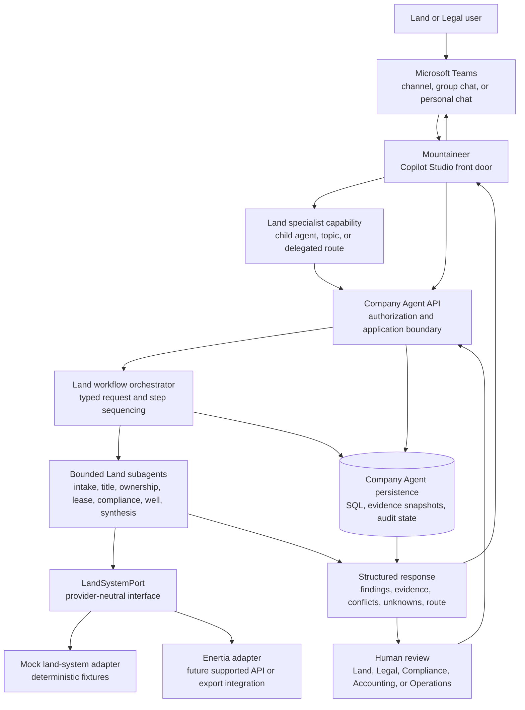
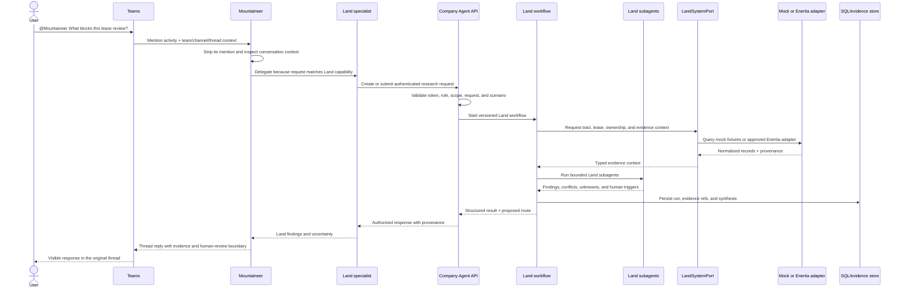

# Company Agent Land architecture

## Executive summary

Company Agent is the application boundary for evidence-bounded land work. The
current Microsoft Copilot Studio agent, `Mountaineer`, is the Teams-facing
conversation surface. A future Land specialist can own Land-specific
conversation and tools, but it should not become a second business system.

The recommended production path is:

```text
Teams @Mountaineer
  → Copilot Studio orchestration
  → Land specialist agent or Land topic
  → authenticated Company Agent API
  → typed Land workflow
  → bounded Land subagents
  → LandSystemPort
  → Enertia adapter or another approved source
  → structured findings, evidence, and human route
  → Copilot Studio response in the Teams thread
```

The API, not Copilot Studio, remains authoritative for identity, authorization,
case or request scope, evidence provenance, persistence, deterministic
operations, and consequential actions. Copilot Studio decides how to conduct a
conversation and which approved tool or child agent to invoke. Microsoft’s
guidance describes tools as agent capabilities and child agents as lightweight
specialists within a main agent; descriptions influence selection but do not
replace application authorization.^1 ^2

This document separates the verified current state from the target state. The
current Azure API and six-operation OpenAPI file are a safe integration
smoke-test, not the finished Land routing API.

## Goals and non-goals

### Goals

- Give Teams users one understandable entry point for company work.
- Route Land questions to bounded Land capabilities.
- Keep source-system details behind replaceable adapters.
- Preserve independent evidence sources, conflicts, unknowns, and provenance.
- Treat title opinions as human/legal work products.
- Support deterministic local tests before live Enertia access exists.
- Make authentication, deployment, observability, versioning, and rollback
  explicit.

### Non-goals

- Recreating Enertia’s database or undocumented schema.
- Having an AI agent issue or certify a title opinion.
- Letting Copilot Studio directly update Enertia, payments, ownership, or
  regulatory records.
- Treating public well or regulatory records as proof of title.
- Publishing the agent before the authenticated API and Teams smoke test pass.

## Terminology and ownership

| Term | Meaning | System of authority |
| --- | --- | --- |
| Company Agent | The application and C# API boundary | Company Agent |
| `Mountaineer` | Current user-facing Copilot Studio agent | Copilot Studio |
| Land specialist | A bounded Land conversation capability, if created | Copilot Studio plus Company Agent |
| Tract or parcel | The physical or legal land unit being researched | Land system of record |
| Lease or contract | Rights, terms, provisions, and obligations tied to land | Enertia or another approved land system |
| Research request | A user’s question and requested review | Company Agent |
| Evidence | A source-attributed fact or document reference | Company Agent evidence store |
| Title opinion | A human/legal work product about title status | Legal document system or Enertia-linked record |
| Finding | A structured, evidence-referenced business observation | Company Agent |
| Human route | A proposed next step requiring a responsible person | Company Agent and Teams/workroom |

“Land Packet” is not required as a core entity. If users want that phrase, it
can describe a generated collection of research outputs. The durable model
should use tract, lease, evidence, research request, title opinion, curative
requirement, finding, and review.

## Overall architecture



### Boundary responsibilities

#### Microsoft Teams

Teams is the collaboration channel. It carries the mention, thread context,
and visible response. It is not the business router or source-of-record store.
In a channel or group chat, an installed agent normally receives messages when
it is directly mentioned. Teams preserves the thread context, and the agent
should reply in the same thread. Teams channel messages are visible to the
conversation participants, so the response must not expose information that
the channel audience is not authorized to see.^3

#### Copilot Studio

Copilot Studio owns conversational orchestration, agent instructions, topics,
tool descriptions, child-agent delegation, testing, and channel publication.
An agent-level REST API or MCP tool is a callable capability. A child agent is
a specialist conversation boundary that groups its own instructions, tools,
and knowledge. Existing Copilot Studio agents must be published and configured
to allow connections before another agent can connect to them.^2

Copilot Studio may ask for missing information, select a specialist, call an
approved API tool, and present the result. It must not be treated as the
authority for role membership, title status, payment status, or a write to a
system of record.

#### Company Agent API

The ASP.NET Core API is the application boundary. It should own:

- Entra token validation and application authorization.
- Request identity, role, group, tenant, and case/tract scope checks.
- Input normalization and schema validation.
- Selection of the permitted Land scenario and workflow version.
- Evidence acquisition references, immutable snapshots, hashes, and
  provenance.
- Deterministic calculations, identifier normalization, source comparison,
  and date logic.
- Persistence of requests, runs, findings, conflicts, unknowns, and human
  actions.
- Human approval gates before a consequential action.
- Audit logging, correlation IDs, telemetry, and safe error handling.

The deployed API currently exposes a healthy Azure endpoint and a six-operation
read-only OpenAPI contract. It also contains workroom and run routes in the
application. Those routes are not automatically part of the Copilot Studio
allowlist; each route must be explicitly secured, documented, tested, and
approved for exposure.

Important current-state limitation: the API configures Entra authentication in
production, but the current read-only prototype routes do not yet have a
complete route-level authorization policy or OAuth security scheme in the
Copilot-facing OpenAPI document. The unauthenticated REST import is therefore
appropriate only for controlled smoke testing. Production exposure requires
route-level authorization and a documented Entra OAuth contract.

#### Land workflow orchestrator

The orchestrator is an application service, not a Copilot Studio label. It
turns a validated research request into a typed execution context, selects a
scenario from the Land catalog, runs the required bounded steps, and produces
one structured synthesis.

The repository already contains the declarative Land catalog and a deterministic
three-step flagship workflow:

1. `land-case-intake` identifies scope, supplied clues, missing inputs, and
   candidate evidence queries.
2. `land-well-reconciler` compares supplied clues with independent normalized
   public evidence.
3. `case-synthesizer` preserves findings, conflicts, unknowns, provenance, and
   a proposed human route.

The catalog also defines routes for ownership, title-chain, lease lifecycle,
lease obligations, assignment transfer, compliance, division-order, and case
management scenarios. A production orchestrator should use that catalog as a
versioned routing registry rather than duplicating routing rules in Copilot
instructions.

#### Land subagents

Each subagent owns one bounded judgment. Examples include:

| Subagent | Responsibility | Boundary |
| --- | --- | --- |
| Land case intake | Identify scope and evidence gaps | Must not invent identifiers or decide ownership |
| Title-chain review | Trace supplied instruments and identify gaps | Must not certify title or resolve legal effect |
| Ownership review | Compare parties, interests, and authority evidence | Must not infer authority or change a registry |
| Lease lifecycle review | Extract dates, statuses, and obligations | Must not decide default, waiver, or legal effect |
| Lease obligation review | Organize notice, depth, pooling, and development terms | Must route legal interpretation to a human |
| Assignment transfer review | Compare transfer instruments and recorded evidence | Must preserve unresolved chain gaps |
| Compliance review | Compare lease, well, and regulatory records | Must not convert missing evidence into a negative finding |
| Well reconciliation | Compare independent well and production evidence | Must not treat public records as title proof |
| Case synthesis | Consolidate structured outputs and propose one route | Must not take the consequential action |

Subagents consume typed context and evidence supplied by the workflow. They do
not retrieve and parse Enertia or government records directly. This makes their
behavior testable and prevents a prompt from silently changing source authority.

#### `LandSystemPort` and adapters

The port is the provider-neutral interface used by the application:

```text
searchTracts(criteria)
getTract(tractId)
getLeases(tractId)
getOwnership(subject)
getTitleOpinions(subject)
getCurativeRequirements(opinionId)
getDocuments(subject)
```

The port returns normalized records with source identity, retrieval time,
source record ID, document link, and provenance. It does not expose Enertia
table names to subagents.

The first implementation should be a deterministic mock adapter backed by
versioned fixtures. The later implementation should be an Enertia adapter that
uses Enertia’s supported API or export mechanism. Enertia’s public materials
describe customizable lease and contract data, API integration, and CSV/XML
imports and exports, but do not publish a complete schema or data dictionary.^4

The adapter should not connect directly to an undocumented Enertia database.
If Enertia supplies a customer-specific API, the adapter maps that contract to
the port. If Enertia supplies exports, the adapter records the export manifest,
file hash, retrieval time, and parser version.

#### MCP

MCP is a standardized tool protocol. It is useful when several agents need the
same centrally managed set of tools and resources. Microsoft’s guidance also
notes that direct API tools are faster for rapid prototyping, while MCP adds
shared discovery and lifecycle value.^5

For this architecture, MCP is an optional process boundary around the
`LandSystemPort` or adapter. It is not a replacement for the Company Agent
API:

```text
Company Agent workflow
  → LandSystemPort
  → in-process mock adapter, or
  → authenticated MCP client
  → Enertia MCP adapter
  → Enertia API/export
```

A real HTTP MCP server must implement authentication, tool discovery, health
and readiness, input validation, output validation, allowlists, audit events,
and contract tests. MCP tool descriptions and results are untrusted input; the
application must validate critical outputs before they become findings or
actions. The MCP authorization specification uses OAuth for protected HTTP
transports and requires secure token handling and audience validation.^6

The mock should begin as a typed adapter, not a network server. Add a real MCP
transport only when there is a second consumer or a real process boundary to
justify its operational cost.

## Teams mention flow

The following flow shows the intended path when a user asks a question in a
Teams channel. The exact Teams app and Copilot Studio publication settings are
tenant configuration, not code in this repository.



By default, channel and group-chat agents are invoked when directly mentioned.
The response must identify evidence and uncertainty and must not imply that a
title opinion, payment change, filing, or ownership update occurred. If the
result requires human action, the API creates or updates a review route rather
than executing the action.

## Land records and title opinions

The domain should be organized around the land and the work performed on it:

```text
Tract or parcel
  ├── Lease or contract
  ├── Ownership interests
  ├── Source documents and evidence
  ├── Research requests and workflow runs
  ├── Findings, conflicts, and unknowns
  ├── Title opinion document and metadata
  └── Curative requirements and human decisions
```

A title opinion is a legal work product based on title research. The AI may
organize the source chain, identify missing instruments, compare ownership
claims, locate an existing opinion, and prepare a review checklist. It must not
issue or certify the opinion.

When Legal issues an opinion, the final document should be stored in Enertia or
the organization’s linked document-management system, associated with the
relevant tract, lease, or ownership record. Structured metadata may include the
opinion date, attorney, scope, status, affected interest, requirements, and
document version. The exact Enertia record type is configuration-dependent and
must be confirmed with the Enertia administrator; it should not be guessed from
the public marketing documentation.

## Identity and security

There are two separate identities in the current environment:

- `PaulBohnenkamp@landopsdemo.onmicrosoft.com` is the tenant-native work
  identity used for Copilot Studio, Dataverse, and Microsoft 365 administration.
- `paul.bohnenkamp@gmail.com` is the personal Azure subscription-owner identity.

They are not interchangeable. The tenant-native identity authors and publishes
Copilot Studio assets. The personal Azure identity owns or manages the Azure
subscription resources. Entra roles, Power Platform roles, Dataverse roles,
and Azure RBAC roles are separate permission systems.

For production:

- Validate Entra bearer tokens at the API boundary.
- Require route-level authorization for every non-health route.
- Use least-privilege application roles or scopes.
- Use managed identity for App Service to access Azure SQL, Key Vault, Storage,
  and other Azure services.
- Keep Enertia credentials in Key Vault or the approved integration secret
  store.
- Do not pass raw Entra or Enertia tokens through an untrusted model prompt.
- Bind request, run, and task identifiers to the authenticated subject and
  authorized scope.
- Log decisions, tool calls, source references, and failures without logging
  secrets or unnecessary personal data.

Microsoft’s web API guidance describes bearer-token validation and authorization
for ASP.NET Core APIs. Azure App Service guidance recommends managed identity
for outgoing access to Azure resources, while MCP’s security guidance requires
protected HTTP servers to validate token audience and expiration.^6 ^7 ^8

## Current and target state

### Current state

- `Mountaineer` exists in Copilot Studio under `DecisionForge (default)`.
- Its instructions and description are saved.
- The API is deployed at
  `https://mountaineer-7pxfuiyt-api.azurewebsites.net/`.
- `/health` returns HTTP 200.
- `/openapi.json` exposes six read-only operations for company, scenarios,
  cases, data-room context, and evidence.
- The repository contains Land agents, skills, scenarios, flows, and a
  deterministic workflow.
- A mock land-system adapter and production routing endpoint do not yet exist.
- The Copilot Studio tool is not yet a production-authenticated integration.
- Mountaineer is published to Teams and has passed a read-only smoke test in a
  controlled channel.

### Target state

- `Mountaineer` remains the company-facing Teams entry point.
- A Land specialist capability is connected as a child or delegated agent when
  its boundary is useful.
- Copilot Studio calls one governed Land research operation for multi-agent
  work, rather than exposing raw source-system operations as the primary UX.
- The API runs a versioned workflow using the Land catalog and typed artifacts.
- `LandSystemPort` supports deterministic mock data and a replaceable Enertia
  adapter.
- A real MCP server exists only if shared process-boundary tools justify it.
- API routes are protected by Entra authorization and the OpenAPI document
  declares the supported security scheme.
- Title opinions and curative decisions are linked human artifacts.
- The Teams publication, evaluation, audit, and rollback records are complete.

## Recommended implementation sequence

1. **Freeze the domain vocabulary.** Use tract, lease, ownership, evidence,
   research request, title opinion, curative requirement, finding, and review.
2. **Build the port and mock.** Define typed `LandSystemPort` records and
   deterministic fixtures for tracts, leases, evidence, title opinions, and
   curative requirements.
3. **Build the routing endpoint.** Add a secured, versioned Land research
   request operation that selects a catalog scenario and returns a structured
   synthesis.
4. **Connect the existing workflow.** Map the catalog’s bounded subagents and
   skills to typed workflow steps. Persist each step and provenance reference.
5. **Strengthen the API boundary.** Add route-level authorization, input/output
   schemas, correlation IDs, rate limits, and audit events.
6. **Use the thin REST contract for early smoke testing.** Keep it read-only and
   controlled; do not treat it as the final routing surface.
7. **Add MCP only when warranted.** Implement the protocol, authentication,
   health/readiness, allowlist, and contract tests around the port.
8. **Obtain Enertia integration material.** Request the supported API/export
   contract, entity dictionary, document access model, sandbox, and read-only
   account.
9. **Implement and evaluate the Enertia adapter.** Compare mock and Enertia
   contract behavior without changing subagent prompts.
10. **Test and publish deliberately.** Run Preview, evaluate representative
    Land questions, publish to a controlled Teams scope, test `@Mountaineer`,
    and record the active version and rollback version.

## Decisions and open questions

### Decisions

- `Mountaineer` is the current user-facing Teams agent.
- Company Agent remains the application and authorization boundary.
- Land subagents own bounded judgments; they do not own source access.
- Enertia is an external system of record behind an adapter.
- Title opinions require human/legal authorship or approval.
- A deterministic mock comes before a real Enertia MCP server.
- The current six-operation REST contract is a prototype integration slice.

### Open questions

- Does the Enertia customer deployment expose an API, exports, or both?
- Where does that deployment store title-opinion documents and curative status?
- Which Entra application registration and scopes should protect the API?
- Should Copilot Studio call a single Land research operation or connect to a
  published Land child agent?
- Which Land scenarios are safe for automatic read-only execution?
- Which responses may appear in shared Teams channels versus personal chat?
- What exact human roles can approve title, payment, filing, and ownership
  actions?

## Defensibility checklist

Before calling the architecture production-ready, verify:

- Every source fact has a source identity, snapshot, record ID, and retrieval
  timestamp.
- Independent sources remain independent; conflicts are preserved.
- Missing evidence is distinct from a failed retrieval.
- Findings are structured and linked to evidence.
- Title opinions are clearly labeled as human/legal artifacts.
- Copilot descriptions do not grant access.
- Every API route validates identity and scope.
- Every write or consequential action has a human approval record.
- Mock and Enertia adapters satisfy the same typed contract tests.
- MCP tools are allowlisted and their outputs are validated.
- Teams responses respect the audience of the channel or chat.
- Deployments are versioned, evaluated, observable, and rollback-capable.

## Sources

1. Microsoft, [“Add tools to custom agents”](https://learn.microsoft.com/en-us/microsoft-copilot-studio/add-tools-custom-agent), Copilot Studio documentation, accessed September 9, 2026. Covers agent-level tools, including REST API and MCP tools.
2. Microsoft, [“Add a child agent”](https://learn.microsoft.com/en-us/microsoft-copilot-studio/add-agent-child-agent), Copilot Studio documentation, accessed September 9, 2026. Covers child-agent grouping, descriptions, and delegation.
3. Microsoft, [“Channel and group chat conversations for agents”](https://learn.microsoft.com/en-us/microsoftteams/platform/bots/how-to/conversations/channel-and-group-conversations), Teams documentation, accessed September 9, 2026. Covers mentions, thread context, scopes, and shared visibility.
4. Enertia Software, [“Land, Contracts, & Mapping”](https://www.enertia-software.com/land-contracts-mapping), accessed September 9, 2026. Describes lease/tract structures, ownership, documents, customization, and land integration.
5. Microsoft, [“Tools, knowledge, MCP, and API”](https://learn.microsoft.com/en-us/microsoft-copilot-studio/guidance/voice-agents-tools-knowledge-mcp), Copilot Studio guidance, accessed September 9, 2026. Compares APIs and MCP and explains tool orchestration.
6. Model Context Protocol, [“Authorization”](https://modelcontextprotocol.io/specification/2025-03-26/basic/authorization), specification, accessed September 9, 2026. Covers OAuth, token handling, discovery, expiration, and secure HTTP transports.
7. Microsoft, [“Quickstart: Protect an ASP.NET Core Web API”](https://learn.microsoft.com/en-us/entra/msidweb/getting-started/quickstart-webapi), accessed September 9, 2026. Covers Entra bearer-token validation and authorization.
8. Microsoft, [“Secure your Azure App Service deployment”](https://learn.microsoft.com/en-us/azure/app-service/overview-security), accessed September 9, 2026. Covers managed identities and App Service authentication/authorization.
